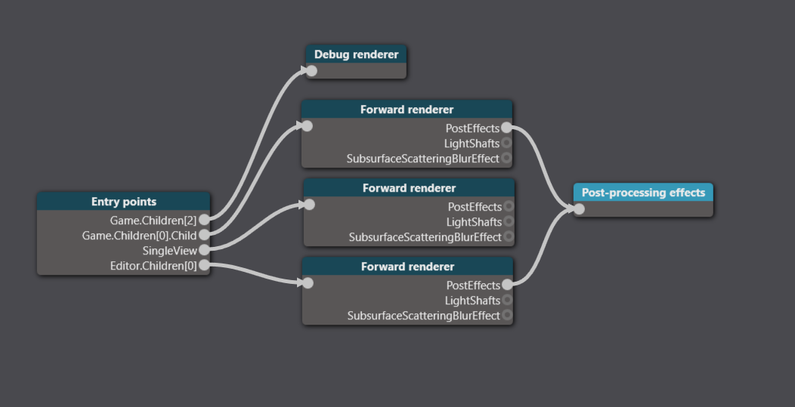
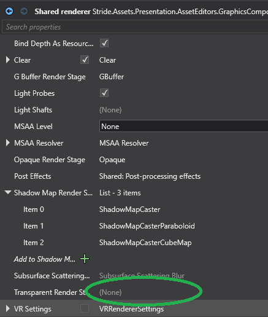
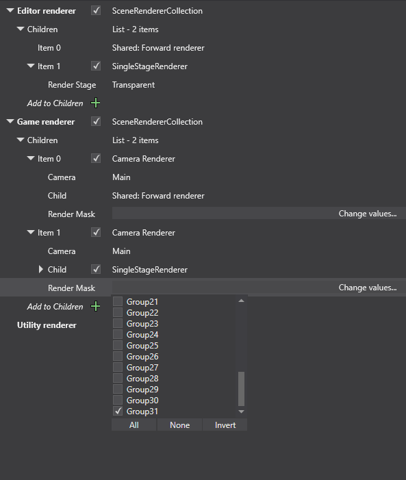
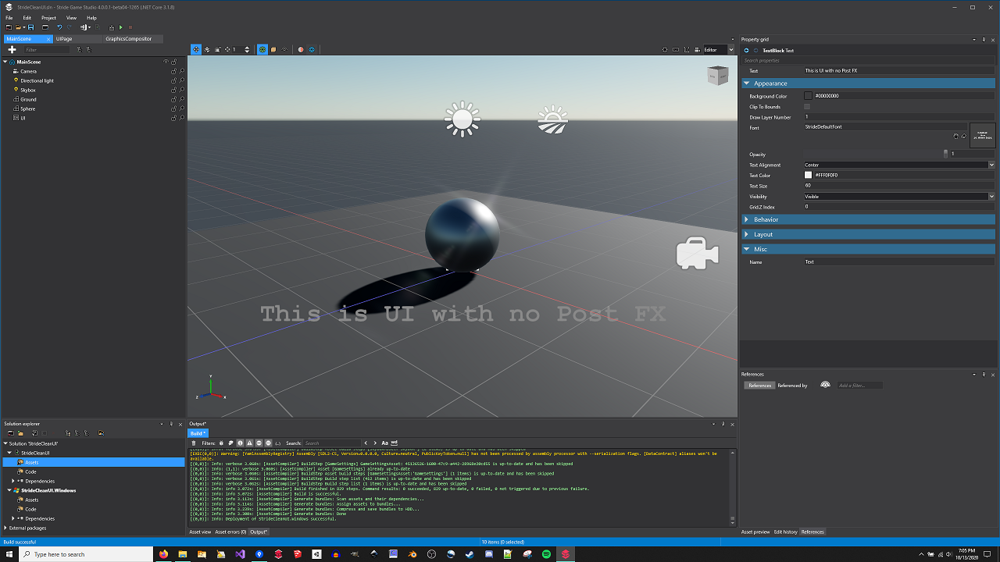
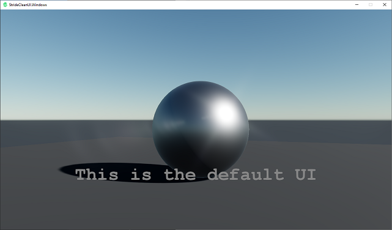
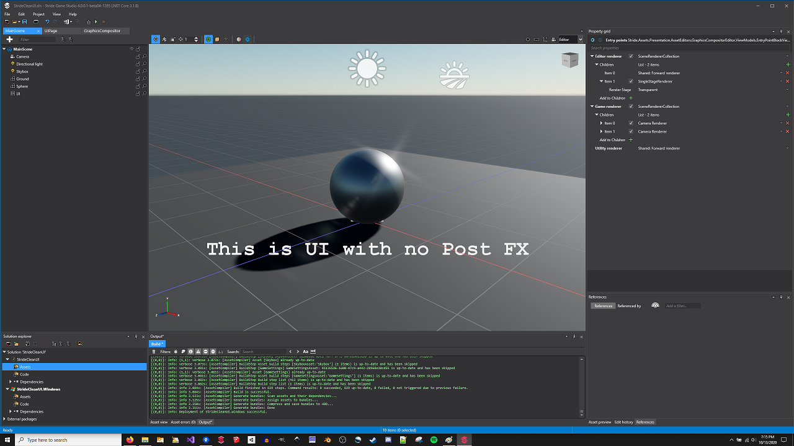
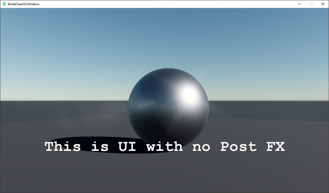

# StrideCleanUI

This is a sample project for rendering clean UI in your game as well as in game studio. The default graphics compositor for Stride renders UIComponents in a Shared Renderer with Post FX enabled... this makes UI look horrid. There are several things you can do to clean this up. This is the simplest way I've found to address this default behavior.

 

1) Modify the graphics compositor in the Editor section to begin with a SceneRendererCollection. Make the first item connect to a new SharedForwardRenderer with NO Transparent stage selected. Ensure this entry is passed to Post FX (because you'll want to see those in game studio).
2) Add another entry to the Editor section to do a single stage renderer for just the transparent layer. This will render your UI clean with no Post FX in the editor.

 
 
 

3) Do something similar for the Game section, though this time use CameraRenderers. These allow you to use the RenderGroupMask functionality and split groups into separate renderers.
4) Use a higher group number (RenderGroup31 below) to isolate your UIComponents. Then have the second CameraRenderer handle just that group with a SingleStageRenderer and the transparent stage.

 
 
 
 
 5) The above items should render both the Editor and your Game with clean UI, both outside of Post FX. 
 6) You can do quite a bit more here with CameraRenderers and RenderTextures to ensure UIComponents are at the correct "level" or "depth" in your scene (Menu, HUD, Player Health, etc). Having a camera render only UI to render texture and then using ImageElements is a perfect work around for this, you'll have to clear the texture though.
 7) For in-depth UI/menu work, it has been best for me to consolidate all UI into a single UIPage with multiple Grids and or Modals and Enable them in code as necessary. This way you can use the Z depth parameter on the UI components directly, though this doesn't work for UIComponents in 3d world space, for that use the approach mentioned in #6.
 
 Results:
 
  
  
  
  
  
