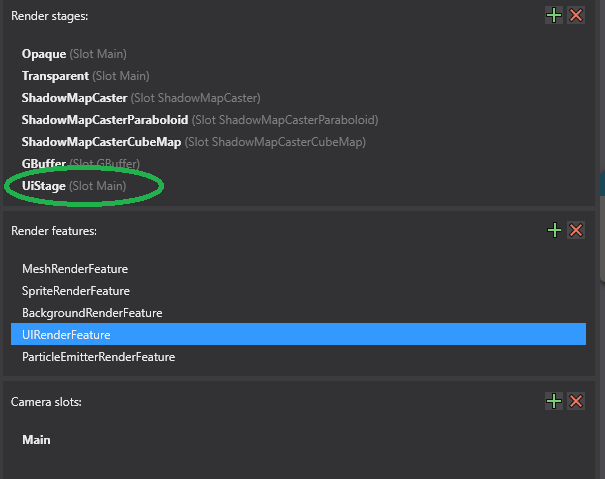
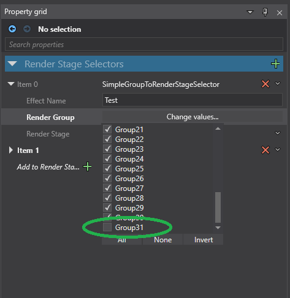
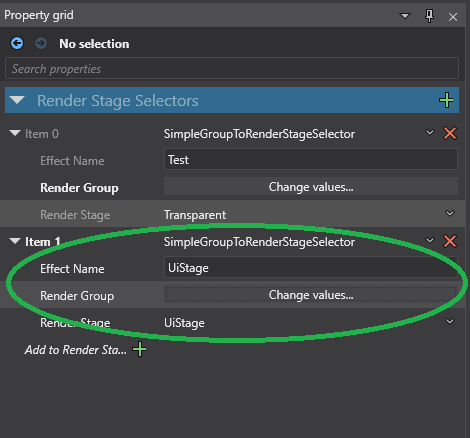

# StrideCleanUI

This is a sample project for rendering clean UI in your game as well as in game studio. The default graphics compositor for Stride renders UIComponents in a Shared Renderer with Post FX enabled... this drastically modifies the appearance of ui, making it dim or blurry. Below is the simplest way I've found to address this behavior without causing any other pipeline issues. I would recommend not changing the default Transparent stage, as modifying this can impact shaders later on.

## An example:

 

The compositor...

 

1) Create a new render stage called "UiStage." This will be used later in the graphics compositor (to order the UI rendering last). For this stage, assign only RenderGroup31 to it.

On the left side:
 
 
On the right side:
 
 
 

2) Modify the graphics compositor in the Editor entry point to include a SceneRendererCollection. 
3) Leave the default shared forward renderer.
4) Add another entry to the Editor section as a SingleStageRenderer for the newly created "UiStage" stage.
5) Do something similar for the Game entry point, though this time use CameraRenderers. These allow you to use the RenderGroupMask functionality and split groups into separate renderers.
6) Use a higher group number (RenderGroup31 below) to isolate your UIComponents. Then have the second CameraRenderer handle just that group with a SingleStageRenderer and the "UiStage" stage.

 
 
7) Go to your Entities (in the scene) and select the UIComponent, change the RenderGroup to RenderGroup31).
8) The above items should render both the Editor and your Game with clean UI, both with no Post FX applied
9) After working quite a bit with Stride UI, I can see that it is quite capable. I would personally recommend making all game UI a member of a single UI page and use Grids to isolate the different functionality (Hud, Menu, etc). This way also you can take advantage of Grid zDepth and layering to control what is in "front" and what is in "back."
 
Results:
 
  
  
  
  
  
  
  
